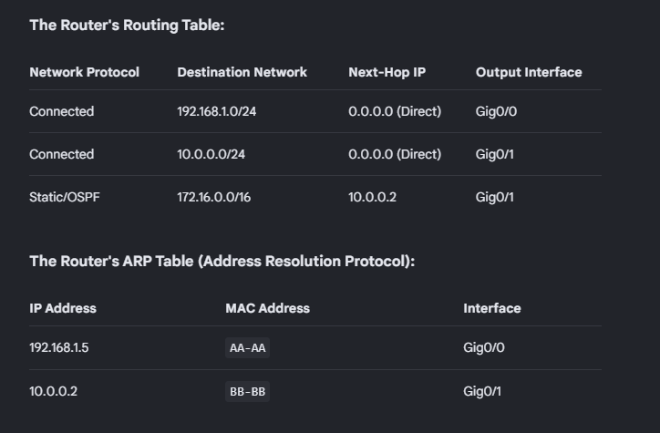

ROUTER OPERATIONS FLOW DIAGRAM: 
===============================
       
       [ Frame Enters Ingress Interface ]
                       │
                       ▼
          [ Perform CRC / FCS Check ]
                       │
             Is Frame Corrupted?
             ├──► YES ──► [ Drop Frame ] (End)
             └──► NO
                       │
                       ▼
       [ Check Layer 2 Destination MAC ]
                       │
       Does it match Router's Interface MAC? 
       (Or is it a local Broadcast?)
       ├──► NO  ──► [ Drop Frame ] (Not meant for this router)
       └──► YES
                       │
                       ▼
         [ STRIP Layer 2 Ethernet Header ]
           (Packet is now exposed at Layer 3)
                       │
                       ▼
         [ Check Layer 3 Destination IP ]
                       │
        Is Destination IP the Router itself?
        ├──► YES ──► [ Pass up to CPU/Local OS ] (e.g., Ping, OSPF, SSH)
        └──► NO  ──► [ Decrement IP TTL by 1 ]
                               │
                       Is TTL = 0?
                       ├──► YES ──► [ Drop Packet ] ──► [ Send ICMP Time Exceeded ]
                       └──► NO
                               │
                               ▼
                   [ ROUTING TABLE LOOKUP ]
                     Finds Longest Prefix Match
                               │
                Is a matching route found?
                ├──► NO  ──► [ Drop Packet ] ──► [ Send ICMP Unreachable ]
                └──► YES ──► Identify Egress Interface & Next-Hop IP
                               │
                               ▼
                   [ ARP / NEIGHBOR LOOKUP ]
             Find Destination MAC for Next-Hop IP
                               │
                Is Next-Hop MAC in ARP cache?
                ├──► NO  ──► [ Send ARP Request ] ──► (Queue packet until reply)
                └──► YES ──► Retrieve Next-Hop Destination MAC
                               │
                               ▼
           [ ENCAPSULATE Packet into NEW Frame ]
             • Source MAC = Egress Interface MAC
             • Destination MAC = Next-Hop MAC
             • recalculate CRC / FCS
                               │
                               ▼
                 [ Transmit Bits out Port ] (End)

Step 1: Receiving and Stripping

OSPF:

| LSA Type | Technical Name | Originating Router Role | Scope / Flooding Limit |
| :---: | :--- | :--- | :--- |
| **1** | Router LSA | All OSPF Routers | Local Area Only |
| **2** | Network LSA | Designated Router (DR) | Local Area Only |
| **3** | Summary LSA | Area Border Router (ABR) | Inter-Area (Crosses Areas) |
| **4** | ASBR Summary LSA | Area Border Router (ABR) | Inter-Area (Crosses Areas) |
| **5** | AS External LSA | Autonomous System Boundary Router (ASBR) | Entire OSPF Domain |
| **7** | NSSA External LSA | ASBR inside an NSSA Area | Local NSSA Area Only |

### 📋 OSPF LSA Reference Table

| LSA Type | Technical Name | Link-State ID Field Contents | Advertising Router Field | Flooding Scope | Core Function & Contained Information |
| :---: | :--- | :--- | :--- | :--- | :--- |
| **1** | Router LSA | Originating Router's OSPF Router ID | Originating Router's OSPF Router ID | Inside the originating area only | Advertises local interfaces, IP prefixes, link types (Point-to-Point, Transit, Stub), and metrics. |
| **2** | Network LSA | IP address of the DR's interface on that segment | Designated Router's (DR) OSPF Router ID | Inside the originating area only | Generated on multi-access networks. Lists all routers attached to the shared segment, including the subnet mask. |
| **3** | Summary LSA | Destination network/subnet IP address | Area Border Router's (ABR) OSPF Router ID | Inter-area (floods to other areas via Area 0) | Summarizes and advertises intra-area routes to other OSPF areas. Contains network prefix, mask, and cost metric. |
| **4** | ASBR Summary LSA | OSPF Router ID of the target ASBR | Area Border Router's (ABR) OSPF Router ID | Inter-area (floods to other areas via Area 0) | Advertises the location of an ASBR to areas outside the ASBR's native area. Provides the specific routing metric to reach it. |
| **5** | AS External LSA | External destination network/subnet IP address | Autonomous System Boundary Router's (ASBR) RID | Entire OSPF autonomous system (all standard areas) | Advertises routes redistributed into OSPF from external sources (e.g., Static, BGP, EIGRP). Includes External Metric Type (E1/E2). |
| **7** | NSSA External LSA | External destination network/subnet IP address | ASBR's Router ID inside the NSSA | Inside the Not-So-Stubby Area (NSSA) only | Carries external routes inside an NSSA area where Type 5s are blocked. Converted to Type 5 by the ABR at the area boundary. |

### 🌐 OSPF Area Types Reference Table

| Area Type | Allowed LSA Types | Blocked LSA Types | Default Route Behavior | Recommended Use Case |
| :--- | :---: | :---: | :---: | :--- |
| **Standard / Backbone (Area 0)** | 1, 2, 3, 4, 5 | None | None | Central core area; connects all other non-backbone areas together. |
| **Stub Area** | 1, 2, 3 | 4, 5 | Automatically injected as a Type 3 LSA | Branch offices with a single exit point to Area 0; reduces router memory use. |
| **Totally Stubby Area** *(Cisco)* | 1, 2 | 3, 4, 5 | Automatically injected as a Type 3 LSA | Branch offices with ultra-low power routers; replaces all outside traffic paths with one default hop. |
| **Not-So-Stubby Area (NSSA)** | 1, 2, 3, 7 | 4, 5 | Not automatic; must be configured manually via CLI | Branch offices that must import external routes (e.g., redistribution from a local RIP/BGP connection). |
| **Totally NSSA** *(Cisco)* | 1, 2, 7 | 3, 4, 5 | Automatically injected as a Type 3 LSA | Branch offices with an external connection that want to block all other inter-area summary paths. |
