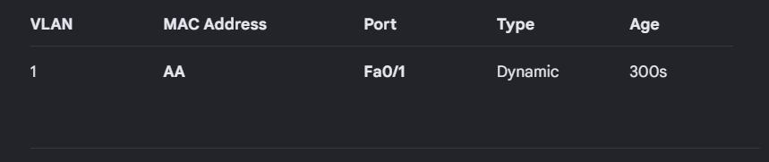
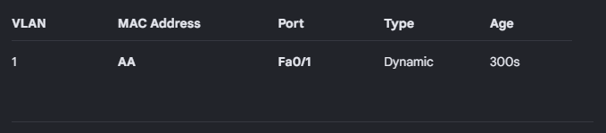
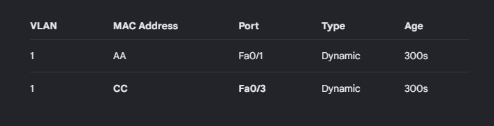
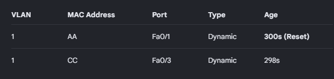
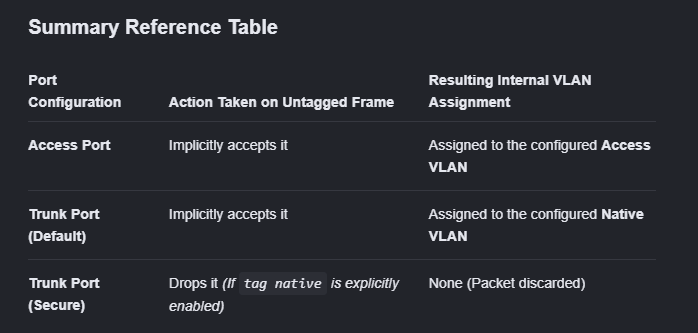

Networking Interview Questions:

Switch Operations:

1. Source MAC Learning
2. Unknown Unicast Flooding
3. HostReception & Processing
4. MAC Table Resolution

SWITCH OPERATIONS FLOW DIAGRAM:
===============================
       [ Frame Enters Ingress Port ]
                     │
                     ▼
          [ Perform CRC / FCS Check ]
                     │
           Is Frame Corrupted?
           ├──► YES ──► [ Drop Frame ] (End)
           └──► NO
                     │
                     ▼
       [ Extract SOURCE MAC Address ]
                     │
       Is Source MAC in CAM Table?
       ├──► NO  ──► [ Map Source MAC to Ingress Port ] ──► (Save to Table)
       └──► YES ──► [ Refresh Entry Timestamp ]
                     │
                     ▼
     [ Extract DESTINATION MAC Address ]
                     │
     What type of Destination MAC is it?
     │
     ├──► BROADCAST / MULTICAST ──► [ Flood Frame out all ports except Ingress ] ──► (Egress)
     │
     └──► UNICAST
               │
      Is Destination MAC in Table?
      ├──► NO (Unknown Unicast)  ──► [ Flood Frame out all ports except Ingress ] ──► (Egress)
      └──► YES (Known Unicast) ───► [ Forward out the specific mapped Egress Port ]
                                                 │
                                                 ▼
                                     [ Apply VLAN / ACL Filters ]
                                                 │
                                                 ▼
                                     [ Transmit Bits out Port ] (End)

Initial State (Empty Table):

Step 1: Host A Sends a Frame to Host C

Step 2: Host C Replies to Host A

Step 3: Host A Sends Another Frame to Host C

**What happens when an untagged frame is received on a access and trunk port in a switch**

1. Received on an Access Port

Incoming Untagged Frame ──► [ Access Port (e.g., VLAN 10) ] ──► Frame is internally tagged with VLAN 10 ──► Switch processes frame normally

2. Received on a Trunk Port

                                                               ┌──► YES ──► Frame is internally tagged with Native VLAN ID ──► Processed normally
                                                               │
Incoming Untagged Frame ──► [ Trunk Port ] ──► Native VLAN configured?
                                                               │
                                                               └──► NO  ──► Frame is immediately DROPPED

